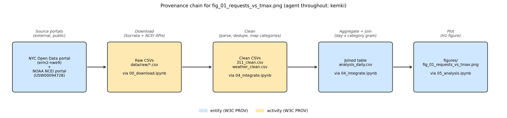

# Provenance & FAIR Self-Assessment

> Filled in during Phase 8, 2026-07-13. See CONTEXT.md §8–9 for the original plan this replaces —
> as elsewhere in this project, this document states what was *actually done and verified*, not
> what was intended.

## Provenance

| Stage | What was recorded | Where |
|---|---|---|
| Download | The exact API query URLs (Socrata SODA `$select`/`$where`/`$order`; NCEI Access `dataset=daily-summaries&units=metric`) — they *are* the filters, and they're versioned code, not a one-off manual step. Plus, per file: download date, file size, row count, SHA-256 checksum. | `notebooks/00_download.ipynb` (queries) + `data/DOWNLOAD_LOG.md` (dated snapshot record) |
| Processing | Every cleaning/join step with row counts printed before/after ("provenance by print statement" — nothing dropped silently). Assessment (Phase 3) is kept as a separate step from cleaning (Phase 4) on purpose, so "what's wrong with the data" and "what I did about it" don't get conflated. | `notebooks/03_quality.ipynb` (assessment only, no fixes) → `notebooks/04_integrate.ipynb` (cleaning + join, with validation cells) |
| Environment | Package versions pinned (`pip freeze`); Python version + pandas version self-printed in every notebook's first cell, so a notebook carries its own environment fingerprint even in isolation. | `requirements.txt` + first cell of all 6 notebooks |
| Figures | Which notebook produced which figure — figure filenames are matched to the notebook that generated them (see table below), not just numbered sequentially by coincidence. | `figures/fig_00…fig_07` ↔ notebooks, mapped explicitly below |

**Figure → notebook mapping** (the two-digit prefix is a global sequential count, not 1:1 with
notebook number — see `docs/DMP.md` §III Naming for why):

| Figure | Produced by |
|---|---|
| `fig_00_weather_overview.png` | `02_explore_weather.ipynb` |
| `fig_01_requests_vs_tmax.png` | `05_analysis.ipynb` |
| `fig_02_heat_vs_tmin.png` | `05_analysis.ipynb` |
| `fig_03_flooding_vs_prcp.png` | `05_analysis.ipynb` |
| `fig_04_correlation_heatmap.png` | `05_analysis.ipynb` |
| `fig_05_missingno_matrix.png` | `03_quality.ipynb` |
| `fig_06_case_duration_hist.png` | `03_quality.ipynb` |
| `fig_07_provenance_chain.png` | `notebooks/build_fig07_provenance_diagram.py` — **not** a numbered analysis notebook (this figure documents the *pipeline*, it isn't an output *of* the pipeline, so it doesn't get an entry in the six numbered notebooks), but a permanently committed script, not a one-off. Correction from the first pass of this document: the script was originally deleted after use, mirroring the throwaway `_build_NN_*.py` scripts used to scaffold the notebooks themselves — but unlike those, this figure has no other code that reproduces it, so deleting the script quietly broke this project's own reproducibility claim for exactly one figure. Caught during a 2026-07-13 audit (see addendum below) and fixed by recommitting the script under a name (no leading underscore) that signals it's meant to stay. |

**How Git contributes:** the commit history shows who changed what, when, and why, for notebooks,
docs, and the mapping table — one feature branch per phase since Phase 3 (see `docs/DMP.md` §III),
`git log --oneline --graph` shows this honestly rather than being rewritten to look tidier than it
was.

**How Jupyter contributes:** each notebook is a lab journal — code, parameters, and results in
execution order. Discipline rule, and verified rather than just claimed (see Reproducibility test
below): **"Restart & Run All" before committing**, so outputs are never stale relative to the code
that (supposedly) produced them.

**W3C PROV framing:** data files are *entities*, notebook/script steps are *activities*, and the
single *agent* throughout is kemki. Originally concept-only (a diagram, not a formal
implementation) — as of the 2026-07-13 audit below, this is now backed by an actual
**[PROV-JSON](https://www.w3.org/submissions/prov-json/) serialization**,
[`docs/provenance.json`](provenance.json): 17 entities (2 source portals, 3 raw files, 3 processed
tables, 8 figures, 1 profiling report), 7 activities (one per notebook/script), 1 agent, and the
`wasGeneratedBy`/`used`/`wasDerivedFrom`/`wasAssociatedWith`/`wasAttributedTo` relations connecting
them — machine-parseable, not just a human-readable table and a picture. The diagram below traces
one chain from that same structure, for the project's central figure:

**Provenance chain diagram** for `figures/fig_01_requests_vs_tmax.png` (the H1 figure — daily
request counts vs. TMAX):

**Honest limit:** Git doesn't version the big raw CSVs or `data/processed/311_clean.csv` (~248 MB,
over GitHub's 100 MB per-file limit) — that gap is covered by the download log (dated, checksummed
snapshot) and the rule that `data/raw/` is never edited, not by Git history. See `docs/DMP.md` §III
Version control.

## Reproducibility test (Phase 8.2)

Performed 2026-07-13: **"Restart & Run All"** (`jupyter nbconvert --to notebook --execute
--inplace`) on notebooks `01`–`05`, in numeric order, using the project's own pinned venv
(Python 3.11.9, kernel `python3` registered to `.venv`).

- **`00_download.ipynb` was skipped deliberately**, not by oversight — re-running it would call the
  live APIs and fetch a *new* snapshot, silently invalidating every checksum in
  `data/DOWNLOAD_LOG.md` and contradicting the project's own "raw data is frozen and dated" rule
  (see `docs/DMP.md` §IV). This is one of the two options the roadmap explicitly sanctions for this
  step; re-running against a new filename was the other, not taken because it adds a second raw
  snapshot with no analytical purpose.
- **All five re-executed notebooks (`01`–`05`) ran clean top to bottom, zero errors.** `nbconvert
  --execute` raises and stops on the first cell exception — none did.
- **Verified outputs are deterministic, not just "ran without crashing":** after the re-run,
  `git diff --stat` on `data/processed/` (the two committed processed tables) and `figures/`
  (all PNGs) showed **zero byte differences** — the entire pipeline from frozen raw CSVs to final
  figures reproduces exactly given the same inputs. Only the notebooks' own execution-count/output
  cells and the `ydata-profiling` HTML report changed (expected — the profiling report embeds its
  own generation timestamp).
- **Conclusion:** "could you reproduce this?" now has a tested answer, not just an intended one —
  yes, deterministically, for everything downstream of the frozen raw snapshot; the raw snapshot
  itself is reproducible in *query* (the API URL is code) but not guaranteed identical in *content*,
  since both source portals revise their data retroactively (see `data/DOWNLOAD_LOG.md`'s
  Reproducibility note).

## Preservation export (Phase 8.2b)

All 6 notebooks exported to static HTML, 2026-07-13: `jupyter nbconvert --to html
notebooks/*.ipynb` → `docs/notebooks_html/` (2.6 MB total, well within GitHub's limits). This is the
rot-proof layer named in `docs/DMP.md` §VIII: pinned `requirements.txt` keeps the notebooks
*runnable* for the medium term, but no environment is guaranteed to still install cleanly in 10
years — the HTML export keeps the executed analysis (code + real outputs, not just code) readable
indefinitely, independent of whether Python 3.11 and this exact package set still exist.

## Machine-readability audit (addendum, 2026-07-13)

Prompted by exam Q&A prep, not part of the original roadmap: a first pass of this document
described FAIR compliance largely in terms of human-readable Markdown — accurate about *what facts
exist*, but not rigorous about whether those facts were in a form a machine could actually act on.
Six specific questions exposed real gaps, fixed where fixable rather than just re-described:

| Question | Was true before this addendum? | Fixed by |
|---|---|---|
| Does every metadata record carry the identifier of the data it describes (F3)? | Partially — Record 3's identifier field was stale ("not yet minted") even after Phase 9 had already reserved a real DOI | Backfilled in `docs/METADATA.md` + `docs/metadata/record_analysis_daily.json` |
| Is the metadata itself machine-readable? | No — Markdown tables only | Added `docs/metadata/*.json`, DataCite Metadata Schema 4.4 JSON, one file per record |
| Are cross-references between resources qualified and machine-readable? | No — prose ("joined with Record 2…") | `relatedIdentifiers` with explicit `relationType` (`IsDerivedFrom`, `IsSourceOf`, `IsSupplementTo`, …) in the JSON records |
| Is the license URL-encoded (a resolvable `rightsUri`, not just a name)? | No | Added for CC BY 4.0, CC0 1.0, and MIT (canonical URIs exist); Local Law 11 links to its codified statute text instead, since it has no CC-style license URI — that's a real, structural difference, not an oversight |
| Is provenance in a standard, machine-readable schema? | No — Markdown table + PNG only | Added `docs/provenance.json`, a real [PROV-JSON](https://www.w3.org/submissions/prov-json/) serialization (17 entities, 7 activities, 1 agent, 5 relation types) |
| Is there committed code to generate *every* figure? | No — `fig_07`'s generating script had been deleted after use | Recommitted as `notebooks/build_fig07_provenance_diagram.py` |

The four DataCite JSON records also picked up a fourth entry, `record_software.json` — the software
deposit had a reserved DOI (Phase 9.2) but no descriptive record of its own until this pass, which
was itself an instance of the first gap above.

## FAIR self-assessment

Key point to lead with: **FAIR ≠ open.** Both source datasets are already open (public, no
restriction), but "open" says nothing about whether data is findable via a persistent identifier,
retrievable by machines, described in a shared vocabulary, or reusable with clear provenance — that
gap is exactly what this table checks. Assessed honestly rather than all-green — an admitted gap is
more credible than a claimed clean sweep (the same principle already applied to the Phase 6 privacy
check in `docs/DMP.md` §VI). Updated 2026-07-13 to reflect the machine-readability audit above —
several rows improved, none went fully green across the board, because the audit fixed specific
sub-gaps without pretending the deeper ones (a real, indexed DOI; a shared complaint-category
vocabulary) went away.

🟢 good · 🟡 partial / planned fix · 🔴 real, currently-unaddressed gap

| Principle | What it demands | Status now | Publication plan |
|---|---|---|---|
| **Findable** | Persistent identifier + rich metadata + indexed in a searchable resource | 🟡 **Sources**: findable via their own portal/station identifiers (`erm2-nwe9`, `USW00094728`), rich metadata in `docs/METADATA.md` + machine-readable `docs/metadata/*.json` (F1–F3 now genuinely satisfied: each record carries an explicit `identifiers` block). **This project's own outputs**: F1 now met by the two reserved Sandbox DOIs (`10.5072/zenodo.562104` software, `.562134` data); **F4 still fails** — Sandbox records are explicitly not indexed anywhere a stranger would search, which is the whole point of them being sandbox | Real Zenodo deposit (`docs/DMP.md` §VII) → the same DOIs become real and indexed by Zenodo's own search and DataCite; nothing else needs to change, since the metadata is already structured correctly |
| **Accessible** | Retrievable via a standard, open protocol; metadata survives even if the data is later removed | 🟢 **Sources**: HTTPS, no authentication, no login. 🟡 **This project's own output**: retrievable via HTTPS (GitHub) today, but if the repo were deleted, the metadata would vanish with it — no independent record | Zenodo = HTTPS access, and critically **A2**: if a Zenodo record is ever withdrawn, the metadata stays resolvable at the DOI — unlike a deleted GitHub repo, where everything disappears at once |
| **Interoperable** | Open, shared formal language for (meta)data; vocabularies that themselves follow FAIR; qualified references to other (meta)data | 🟢 CSV, ISO 8601 dates, standard lat/long for the *data* — consistent throughout, verified in Phase 3. 🟢 I1 and I3 now genuinely met for the *metadata*: `docs/metadata/*.json` is a formal, shared schema (DataCite), and `relatedIdentifiers`/`relationType` are real qualified links, not prose. 🔴 **`data/complaint_category_map.csv` is still a homemade vocabulary** (I2) — machine-readable metadata doesn't touch this gap at all, flagged here rather than hidden, since it's the clearest weak spot left in this whole assessment | A real fix would mean mapping onto an existing municipal-311 taxonomy if one existed; publishing the mapping table narrows the *documentation* gap but a homemade vocabulary stays homemade |
| **Reusable** | Clear, accessible usage license; detailed provenance; meets domain-relevant community standards | 🟢 Licenses precisely cited *and* now URL-encoded as real `rightsUri` values for CC BY 4.0/CC0/MIT (`docs/DMP.md` §VII, `docs/metadata/*.json`); Local Law 11 links to its statute text instead, honestly noted as not a CC-style URI. 🟢 Provenance now both human-readable (this document) and machine-readable (`docs/provenance.json`, PROV-JSON). 🟡 "Community standards" is still a weak fit — there's no single established cross-domain standard for a municipal-311 + climate combination; CSV + explicit data dictionaries + DataCite JSON are the closest practical equivalent, not a formal domain standard | Same licenses and provenance carried into the real Zenodo record — this row needs no further work beyond the deposit itself |

**How this would be shown in the exam:** this table as a slide, traffic-light colors kept, gaps
named out loud (temporary DOI only, homemade vocabulary, no formal community standard) rather than
smoothed over — an honest partial-FAIR assessment is the credible version of this slide, not the
all-green one.
